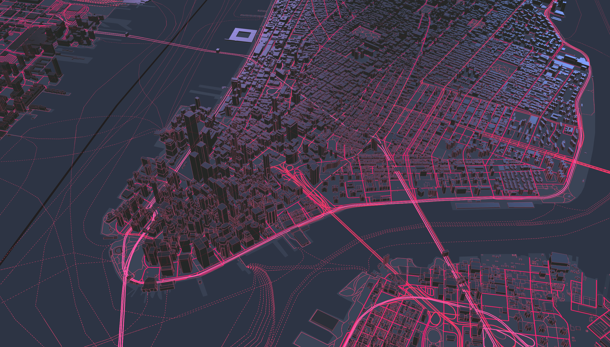

# 3D-web-maps-with-harp.gl
the basics of harp.gl, a new and beta 3D map rendering engine for the web.

## Prerequisites
- Laptop with a modern web browser (Chrome, Firefox, Safari, etc.)
- Node and npm installed (installation directions here)

## Resources
harp.gl Github repo (Source code for harp.gl)
harp.gl documentation
harp.gl examples (curated list of examples)
harp.gl modules on npm

## Data source
A data source is a source of data you’ll add to the map. Generally, when working with maps, we’ll be referring to two different types of data sources:

Static data source: a single object, commonly in the geojson format. Think like a .json file or a javascript object.
Tiled data source: a dynamic data source that is broken up into “tiles”. These tiles, referenced by parameters {x}, {y} and {z}, are divided by different locations and zoom levels on the map. Tiled data sources are preferred for large data sets because the map only requests data for the current view of the renderer.
HERE Studio provides a hosting and tiling service we will be using later on in this tutorial. You’ll be able to upload large datasets and Studio will provide and endpoint to access this data using the {x}, {y} and {z} parameters.

## harp.gl style sheets and syntax
harp.gl has its own syntax for styling the map. The styling syntax lives inside a json file and contains rules for how the visuals are drawn. For example, in the style sheet, you can specify things like.

the width for roads
the background color for water
the mulitplier of the height of 3d buildings
You can take a look at a sample style sheet here: [https://unpkg.com/@here/harp-map-theme@latest/resources/berlin_tilezen_night_reduced.json](https://unpkg.com/@here/harp-map-theme@latest/resources/berlin_tilezen_night_reduced.json)

## Style a point

This technique will style all geometry types that are points with #7ED321 color and 15 size.
## Style a line

This technique will style all geometry types that are lines with blue color and 1px width.

renderOrder is the z-index value for the render order. A large number means that the object will show up first.
## Style a polygon

This technique will style all geometry types that are lines with #525556 color and 0.8 opacity.
## Projections
Technically, all maps have been lying to you. That’s because it’s difficult to project the spherical earth onto a perfect rectangle.

Side note: for some fun with mercator projections, check out The True Size of, a cool web app to explore the different sizes of countries depending on where they are.

harp.gl provides two different views:

mercator: the classic and one of the most popular flat projections
globe: an accurate representation of earth as a sphere, as seen from space.
 
 ## Acquire credentials
harp.gl is an open-source and free software project. However, harp.gl needs to be connected to a data source in order to display a map.

HERE Studio, another HERE product, is a service for storing and managing geospatial data. HERE XYZ will provide the vector tile data endpoint and authentication for harp.gl.

